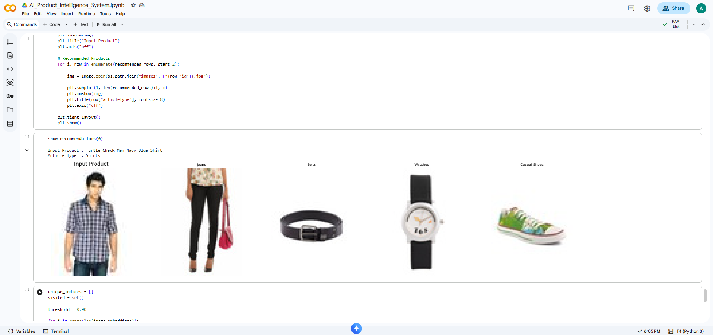
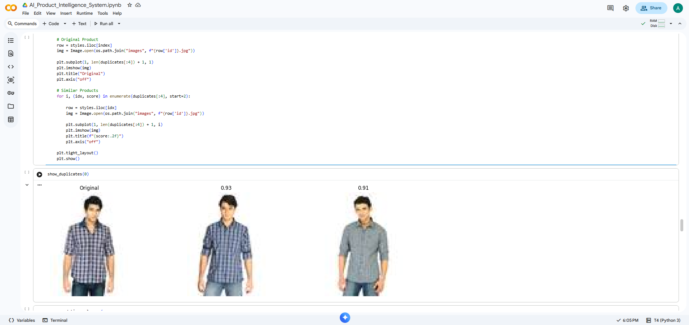
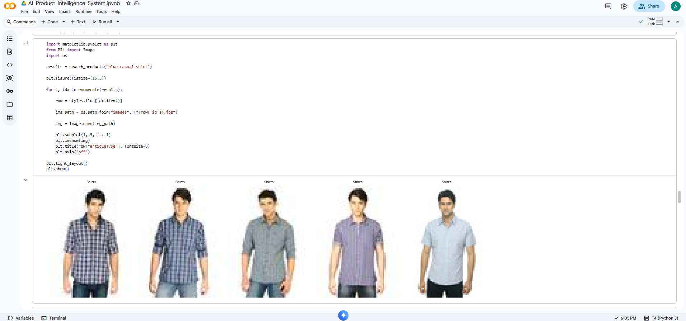

## 🚀 Features

### Task 1 – Smart Product Recommendation Engine

The system recommends complementary fashion products for the selected item.

---

### Task 2 – Unique Product Catalog

The system detects duplicate products using cosine similarity and creates a unique product catalog.

---

### Task 3 – Reverse Product Search

The system accepts a text query and retrieves visually similar fashion products using OpenCLIP embeddings.

